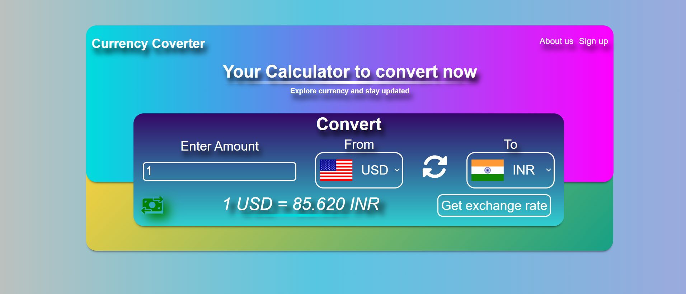

# 💱 Currency Converter

## A simple and interactive currency converter web app that allows users to convert from one currency to another using real-time exchange rates. Built using HTML, CSS, and JavaScript.

## 🔗 Live Demo

👉 [https://currencyconverter-partha.netlify.app/](https://currencyconverter-partha.netlify.app/)

---

## 📸 Screenshots

| Screenshots                      |
| -------------------------------- |
|  |

---

## 🚀 Features

- 🌍 Supports multiple currencies with country flags
- 🔄 Swap currencies with a single click
- 💵 Real-time exchange rates using [ExchangeRate-API](https://www.exchangerate-api.com/)
- 🔔 Error handling for invalid inputs
- ⚡ Stylish and responsive UI

---

## 🛠️ Tech Stack

- **HTML**
- **CSS**
- **JavaScript (Vanilla)**
- **ExchangeRate-API** for live currency rates
- **Flags API** for displaying country flags
---


## 🧪 Getting Started

### 📦 Installation

Clone the repo :

```bash
git clone https://github.com/PARTHA-PATTANAYAK-02/Currency_Converter.git
```

---

## 🌐 Deployment

## This project can be deployed easily using:

- ### 🔗 [netlify](https://currencyconverter-partha.netlify.app/)

## ✍️ Author

**Made with ❤️ by [Partha Pattanayak](https://github.com/PARTHA-PATTANAYAK-02)**
